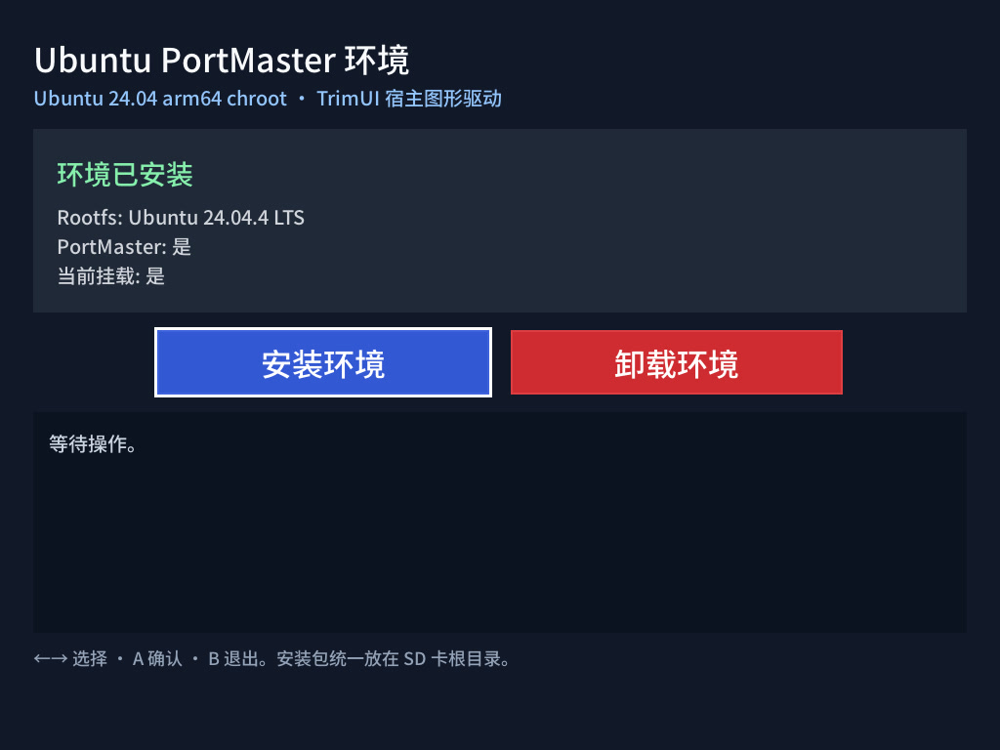

# Ubuntu PortMaster

在 TrimUI 设备上通过图形界面一键安装和管理 Ubuntu 24.04 chroot + PortMaster。

项目将 PortMaster 运行环境与 TrimUI 宿主系统隔离，同时保留对宿主 SDL、GPU、音频和输入设备的使用，让 PortMaster 及其游戏能够从 TrimUI 原生界面启动。

## 运行截图

### 环境管理器



## 功能

- 一键安装 Ubuntu 24.04 arm64 rootfs 和 PortMaster
- 缺少安装包时支持直接下载，并显示下载进度
- 内置 CA 根证书，不依赖 TrimUI 固件的证书环境
- 使用中国大陆 Ubuntu 镜像安装运行依赖
- 自动配置 chroot 的网络、设备、图形、音频和 SD 卡挂载
- 将游戏与存档保存在 SD 卡，重装环境时不会删除
- 为 PortMaster 游戏生成 TrimUI 原生入口
- 自动生成独立的游戏启动脚本
- 将游戏图标规范为 300×300 透明画布
- 支持从界面完整卸载 Ubuntu 和 PortMaster 环境

## 安装

下载或构建 `UbuntuPortMaster.zip`，解压到：

```text
/mnt/SDCARD/Apps
```

最终目录应为：

```text
/mnt/SDCARD/Apps/UbuntuPortMaster
```

随后在 TrimUI 的 Apps 页面打开“安装Port环境”，选择安装。

安装器需要以下两个文件：

```text
/mnt/SDCARD/ubuntu-base-24.04.4-base-arm64.tar.gz
/mnt/SDCARD/trimui.portmaster.zip
```

文件不存在时，可以根据界面提示自动下载，也可以手工下载后放到 SD 卡根目录。

默认下载地址：

- [Ubuntu Base 24.04.4 arm64](https://cdimage.ubuntu.com/ubuntu-base/releases/24.04.4/release/ubuntu-base-24.04.4-base-arm64.tar.gz)
- [PortMaster for TrimUI](https://github.com/PortsMaster/PortMaster-GUI/releases/download/2026.07.28-1212/trimui.portmaster.zip)

## 使用

环境安装完成后，从 TrimUI Apps 页面启动 `UbuntuPortMasterRuntime` 进入 PortMaster。

PortMaster 安装的游戏会保存到：

```text
/mnt/SDCARD/Data/ports
```

对应的 TrimUI 原生入口会生成到：

```text
/mnt/SDCARD/Ports/portmaster-游戏名
```

入口包含 `config.json`、`launch.sh` 和经过规范化处理的 `icon.png`。退出 PortMaster 后，新游戏即可从 TrimUI 的 Ports 页面启动。

`launch.sh` 先进入本 App 的 `trimui-chroot-manager --launch-port`。manager 会读取游戏的 `port.json`：对于 PortMaster 标记为 `rtr: false`、需要用户自行提供正版游戏文件的 port，启动前会显示官方安装说明；用户确认后才建立 chroot 环境并运行游戏。该判断不依赖 fbui 或其它前端。

## 数据与目录

默认目录如下：

```text
/mnt/UDISK/ubuntu-portmaster-rootfs            Ubuntu rootfs
/mnt/SDCARD/Apps/UbuntuPortMasterRuntime       PortMaster 运行环境
/mnt/SDCARD/Data/ports                         游戏和存档
/mnt/SDCARD/Ports/portmaster-*                 TrimUI 原生游戏入口
```

Ubuntu 和 PortMaster 的目录名可以通过 `manager.go` 顶部的以下常量调整：

```go
rootFSDirName
portMasterAppDirName
```

## 重新安装与卸载

安装操作始终执行全量重装：先删除现有 Ubuntu rootfs 和 PortMaster 运行环境，再重新安装。

卸载会删除：

- Ubuntu rootfs
- PortMaster 运行环境
- SD 卡根目录中的 Ubuntu 和 PortMaster 安装包

以下目录不会删除：

```text
/mnt/SDCARD/Data/ports
```

因此已安装游戏及其存档会保留。

## 构建

```sh
GOEXPERIMENT=simd go test ./...
./make.bash
```

构建产物：

```text
UbuntuPortMaster.zip
```

## 技术文档

完整的环境结构、挂载关系和手工复现步骤见：

[docs/trimui-ubuntu-portmaster-reproducible.md](docs/trimui-ubuntu-portmaster-reproducible.md)
